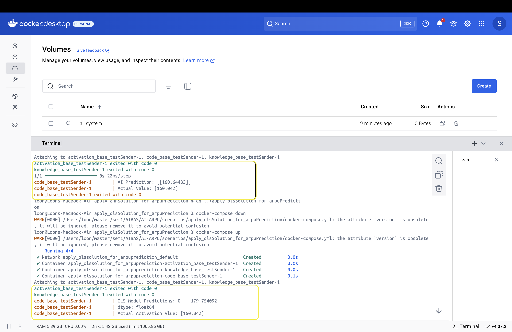

# Welcome to the AI-based ARPU Prediction for Telecommunication Customers

Authors: Osman Mohammd & Sara MohammedAhmed  

Course: M. Grum: Advanced AI-based Application Systems  

Institution: University of Potsdam  

License: AGPL-3.0  


## Project Overview
This project predicts Average Revenue Per User (ARPU) for telecommcutication customers in Southeast market. ARPU is one of the main KPI's used by telecommunication  companys to assess the financial health of their cutomer base. It represents the avarege revuene for the company that is earned from each cutomer. 
And is calculated by dividing the `total revenue` by the `total number of subscribers`. By applying our model one the Call Details Records(CDR) the results would play a pivtal role in forecasting future revenue streams, identifying at-risk customers, and designing targeted marketing strategies.  

In this project we used two different models:  

**1- Ordinary Least Squares (OLS) Regression** A statistical approach for linear modeling.  

**2- Artificial Neural Network (ANN)** A deep learning approach for complex relationships.  

The project is structured to follow the AI-CPS framework, an open-source platform for cyber-physical systems originally developed by **Dr.-Ing. Marcus Grum**. We forked AI-CPS and adapted its structure to include following images:  

**- KnowledgeBase:** Provide trained AI model at "tmp/knowledgeBase/".  

**- ActivationBase:** Provide 'activatio_data.csv' at "tmp/activationBase/".  

**- LearningBase:** Provide 'training_data.csv' at "tmp/learningBase/train/" and 'test_data.csv' at "tmp/learningBase/validation/" also Stores training logs, validation metrics, results, and model visualization.  

**- CodeBase:** Provide Python scripts for data scraping and cleaning, AI model training and evaluation.  

 And it is fully containerized using Docker, and the images are published to the public [dockershub](https://hub.docker.com/r/olexuni) making it easy to deploy across different environments.  


## Getting Started
The dataset is scraped from the publicly avaiable [dataset](https://www.kaggle.com/datasets/shivam131019/telecom-churn-dataset?resource=download&select=telecom_churn_data.csv) on Kaggle, the data is then scraped from a [repostory](https://raw.githubusercontent.com/osman-mohmmed/aibas/refs/heads/main/data/telecom_arpu_data.md). later on its processed, and prepared for training a AI model to predict ARPU values based on various customer features. By utilizing `TensorFlow`.     

### 1) Prerequisites
Before you begin, ensure you have the following installed: git client, Python 3.7+, Docker. Additionally, you will need Python libraries such as: TensorFlow, Pandas, Numpy, Matplotlib and Scikit-learn.   

### Installation Instructions
#### Python and other dependancies.
if not already installed and running they could be downloaded following those instructions  

#### **Windows**
### **Install Python (if not already installed)**
   ```bash
   winget install Python.Python.3.7
   ```

 ### **Install the Python libraries**
   ```bash
   pip install -r requirements.txt
   ```
### Create a virtual environment
 ```bash
python -m venv venv
 ```  

### Activate the virtual environment
 ```bash
 .\venv\Scripts\activate
  ```


---

##### **Linux**
**Install Python 3.7+ (if not already installed)**
**Linux** (Ubuntu/Debian-based):
   ```bash
   sudo apt update
   sudo apt install python3.7 python3.7-venv python3.7-dev
   ```

**macOS** (using Homebrew):
   ```bash
   brew install python@3.7
   ```
 ### Create a virtual environment
 ```bash
python -m venv venv
 ```  

### Activate the virtual environment
 ```bash
 .\venv\Scripts\activate
  ```  

### Docker Installation Instructions

##### Windows:

1. Download the Docker Desktop installer for Windows from the official Docker website:
   [Docker Desktop for Windows](https://www.docker.com/products/docker-desktop)

2. Run the installer and follow the installation steps. After the installation is complete, Docker should start automatically.

---

##### Linux:

1. Follow the installation instructions from Docker website:
   [Docker Desk for linux](https://docs.docker.com/desktop/setup/install/linux/)

---

##### Mac:

1. Download the Docker Desktop installer for Mac from the official Docker website:
   [Docker Desktop for Mac](https://www.docker.com/products/docker-desktop)

2. Run the installer and follow the instructions. After installation, Docker will start automatically.

---


### 2- Use Case for applying ANN moldel on activation data:

To apply the ANN molde to predict ARPU of signle data poit, follow these steps:

1. **Clone the repository**:
   ```bash
   git clone https://github.com/osman-mohmmed/AI-ARPU/
   cd <your_repository>
   ```
2. **Create a docker volume**
   ```bash
   docker volume create ai_system
   ```

3. **Build the Docker images**  
   Build the Docker images for training and prediction:
   ```bash
   docker-compose build
   ```
   This will create the necessary Docker containers for running the model training and inference.

4. **Navigate to the annSolution compose-file**  
   Following those commands based on your own path where you have downloaded the repository, then navigate to Scenarios directory where we have the ANN & OLS models.
   ```bash
   cd <yourPath>\AI-ARPU\scenarios\apply_annSolution_for_arpuPrediction
   docker-compose up   
   ```
   
5. **Apply the same for OLS model**  
   ```bash
   cd <yourPath>\AI-ARPU\scenarios\apply_olsSolution_for_arpuPrediction
   docker-compose up   
   ```
**One should expect resluts like below**


   
By running those docker files, it will bulid the whole ANN and OLS applications starting from the knowledgeBase, then activationBase and codeBasefile and eventually both models.   
for more information about the content of the docker files and the conatiners, kindly refer to the project's [github](https://github.com/osman-mohmmed/AI-ARPU.git)
